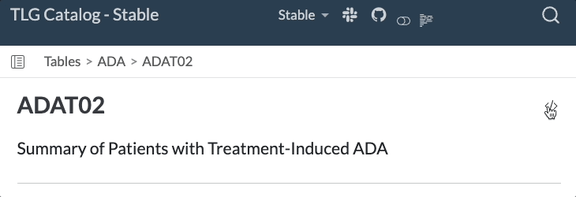
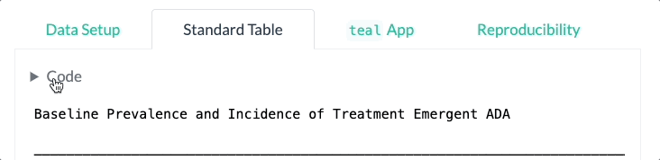

# 

The TLG catalog is a catalog of **T**ables, **L**istings, and **G**raphs for clinical trials generated using NEST packages.

This repository provides a comprehensive collection of clinical trials outputs generated using the R language.
The target audience is the clinical trials community, including statisticians, data scientists, and other professionals interested in applying R to clinical trials data.

## Usage

Each TLG is represented on a separate article page, typically including the following sections:

- Setup and pre-processing of synthetic data.
- Steps to produce the TLG.
- The output TLG generated by the given code (including any available variants).
- An interactive application that can alternatively be used to produce and interact with the TLG.
- Reproducibility information.

See the full list of available TLGs on the [Index page](tlg-index.qmd).

### Interacting with Catalog R Code

::: columns
::: {.column style="vertical-align: middle; width: 30%; padding-right: 5%"}
The full source code of each article can be viewed by clicking on the "Source Code" button at the top of the page and copied using the "Copy to Clipboard" button.
:::

::: {.column style="vertical-align: middle; width: 65%"}

:::

::: {.column style="vertical-align: middle; width: 30%; padding-right: 5%"}
Individual code chunks from within the article can also be viewed and copied.
:::

::: {.column style="vertical-align: middle; width: 65%"}

:::

::: {.column style="vertical-align: middle; width: 30%; padding-right: 5%"}
The Reproducibility tab contains session information and allows one to install the packages required to properly run the code.
:::

::: {.column style="vertical-align: middle; width: 65%"}

:::
:::

## License

This catalog as well as code examples are licensed under the Apache License, Version 2.0 - see the [LICENSE](LICENSE) file for details.

## Contributing

We welcome contributions big and small to the TLG catalog.
Please refer to the [Contributing](CONTRIBUTING.md) guide for more information on how you can contribute.
Use the `giscus` panels at the bottom of each page to share your feedback & ideas, ask questions, and report issues.

## Development

This website is built using [Quarto](https://quarto.org/) and hosted on [GitHub Pages](https://pages.github.com/).
This website is rebuilt and republished daily as well as every time a change is pushed to the repository as part of the CI/CD process.

The catalog is rendered using "Stable" and "Development" profiles.
The main difference between these two profiles is the package versions used to generate the outputs.
The "Stable" profile uses the most recently released versions of all packages, whereas the "Development" profile uses the latest development versions of all NEST packages.
This means that the same R code (e.g. `foo::bar()`) would be run using both the latest released and development package versions (e.g. `foo@v1.2.3` on the "Stable" profile and `foo@v1.2.3.9123` on the "Development" profile).
If your article is affected by API changes between released and development versions, please consider [conditional content](https://quarto.org/docs/authoring/conditional.html) (checking `QUARTO_PROFILE` environment variable) and/or `if` statements on respective package versions to enable the article to work in both profiles.

As a part of the CI/CD process, each article's code is checked for quality, coherence, and readability using tools such as `lintr`, `styler`, and `spelling`.
Additionally, regression testing is performed using `testthat` snapshot testing (see the [package component of the repository](https://github.com/insightsengineering/tlg-catalog/tree/main/package) for more details).

If you are adding a new table, listing, or graph in the form a new `.qmd` file, then you will also need to update the index in the [tlg-index.qmd](tlg-index.qmd) file with the new file name.
To do so, run the R code in the [generate-index.R](generate-index.R) file after creating your template.
